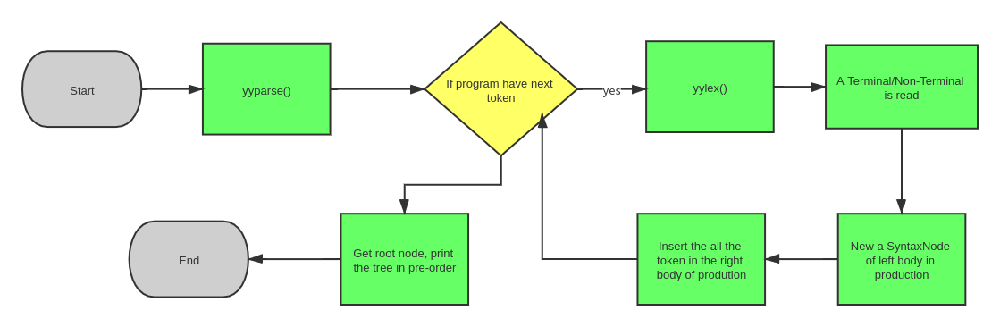
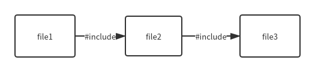

# CS323 Project1

11811620 毛尊尧 11811535 武尚萱 11813121 张家澍

## 1.Lexical and Syntax Analysis design

For the basic requirement, we define a class called `SyntaxTreeNode` ,which is like:

```c++
class SyntaxTreeNode {
public:
    TreeNodeType nodeType = TreeNodeType::OTHER;
    SyntaxTreeNode *parent{};
    std::vector<SyntaxTreeNode *> children;
    std::string attribute_name;
    std::string attribute_value;
    int firstLine = 0;
    int firstColumn = 0;
}
```

When we reading tokens using `yylex`, the terminal token will be created, and its name, location and value will be stored. We use `nodeType`  to support different print option.  The program procedure is like this(error recover will be discussed later):



1. In flex/bison, if a terminal/non-terminal is created, we new a new syntax node, and insert all its children node. Then we get a tree bottom to top.
2. print the tree in preorder.

### Error Recovery

We handled two kinds of error in this project: lexical error and syntax error. Type, line number and reason will be printed for each kind of error.

#### Lexical error

We have written regular expressions that match the wrong grammar. When they are matched, the error message that matches the lexical grammar will be typed together with the type and number of lines. 

For **line number**, We use `yylineno` provided by lex. The method of use is as follows:

1. Add `%locations` in `parser.y`
2. Include lexer file in `parser.y`
3. Add the `%option yylineno` option in our lexer file

We use `yytext` to **get invalid text**.

If we just print the error message without returning a token, the normal parsing process will be terminated. Therefore, we **defined token `ERROR` **and added the corresponding production in `parser.y`.

```
%nonassoc <node_type> ERROR
Exp: Exp ERROR Exp {}
    | ERROR {}
```

In order to **stop printing the syntax tree when an error occurs**, we define the variable `has_error` to record whether the error exists. 

The **types of lexical  error** we define are as follows:

1. empty or too long char
2. invalid hex char with wrong character or too long
3. invalid int start from 0
4. invalid hex int
5. invalid id start with number
6. all unmatched characters

This is an **complete example**:

```c
INVALID_CHAR ''|'[^']{2,}'
{INVALID_CHAR} {
  has_error=true;
  printf("Error type A at Line %d: unknown lexeme %s\n", yylineno, yytext);
  return ERROR;
}
```

#### Syntax error

We use `bison`'s error recovery mechanism, added error at the appropriate position, and printed the corresponding type of error message afterwards. Type and line number information is printed in `yyerror()`

For **line number**, use `yylineno` too.

In order to process the error message uniformly, we define the function`error_message()`. In this function, we ensure that **a message must be printed and only one message will be printed for an error**. If we can not find the most matching error message, it will be “syntax error”. A counter `error_cnt` helps me realize that.

In the process of setting the error, I found that the **position of the `error`** has a great influence on the judgment of the error. To ensure that the error report is as accurate as possible, I tried many kinds of positions and added as many kinds of errors as possible. Regarding the location of the `error`, I have summarized three tips:

1. If the missing part is at the beginning of the production, do not put `error` at the beginning.
2. Put error before symbols like SEMI, RP
3. Avoid tokens after error` have the same priority

The **types of syntax error** we define are as follows:

1. missing { or }, [ or ], ( or )
2. missing specifier
3. missing semicolon
4. missing comma

This is an **complete example**:

```c
int error_cnt = 0;
void error_message(const char* message){
    if(error_cnt > 0){
        printf("%s\n", message);
        error_cnt -= 1;
    }
}
void yyerror(const char* s){
    has_error = true;
    error_message("Syntax error");
    error_cnt += 1;
    printf("Error type B at Line %d: ", yylineno);
}
ExtDef: Specifier error {error_message("Missing semicolon ';'");}
```

## 2. Bonus Feature

### 1. Single-line and Multi-line Comment

We use regular expression to distinguish these two tokens. We use these regex to match comments:

```c++
"//" {
    char c = yyinput();
    while(c!='\n'){c=yyinput();}
}
[/][*][^*]*[*]*[*][/] {}
[/][*][^*]*[/][*][^*]*[*]+[/][*]*[*][/] {  
	printf("Error type A at Line %d: nested /*\n", yylineno);
	return ERROR;
}
[/][*] {   
 	printf("Error type A at Line %d: unmateched /*\n", yylineno);
	return ERROR; 
}
```

For multiple lines comment, we set match the /* ... */ as a whole and discard it. And if it is nested, we need to throw error, which need another regex.

### 2.`for` Statements

We need add such product:

```c++
Stmt:FOR LP Exp SEMI Exp SEMI Exp RP Stmt
```

Note that the for can not support declaration but only assignment.

### 3. File Inclusion

We support `#include <filePath>` syntax to include other files. The file will be read into syntax analyzer, too. To achieve this, we need to set up a stack to store the input stream. When need to handle two state:

1. when `#include` token is read, we store the  current input stream, change the input stream to next.
2. when `<EOF>` token is read, we close current input stream, pop the stack, and switch the input stream. If stack is empty, it means we have already read all of files, we do `yyterminate`().

By doing so, we can achieve recursive file inclusion. For example, if the include relation is as follows:



Then the content will be:

```cpp
int function_in_file3();
int function_in_file2();
int function_in_file1();
```

## 3. Test Case Design

We have defined five test examples: the first is legal, the second and third contain lexical errors, and the fourth and fifth contain syntax errors.

**Checked in legal test case**:

1. definition of global variable
2. definition of struct
3. definition of function with different type and amount of arguments
4. compact calculation, contains `&&` and `||`
5. definition of int and hex int, char and hex char, float and struct instance
6. definition and visit of array
7. nested function call
8. while loop and if-else

**Checked lexical error**:

1. special invalid int and hex int, such as `0000` and `0x00`
2. special invalid char and hex char, such as `‘0xaaaaaa’` and `‘aaaaa’`

Variables starting with special symbols and numbers are **already in the provided test cases**, so they are not included

**Checked syntax error**:

1. missing specifier of struct
2. missing comma between two global variables and function arguments
4. missing left parentheses of a function